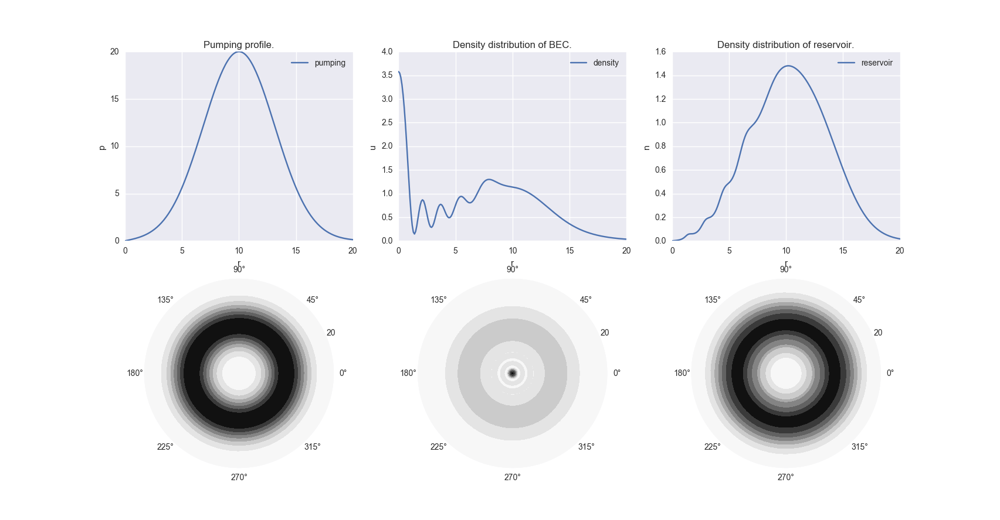

# Non-linear Schrodinger Equation Solver(NLS)

## Description

Package to solve non-linear Schrodinger equation written with Fortran 95 and Python 2.

NLS is scientific package that provides ability to solve effeffectively non-linear schrodinger equation with reservoir. These equation describes exciton-polariton condensation in microcavities. NLS is built on native fortran code and is based on certain natural abstraction layer that wraps native solver. These features are reason that makes calcualtions with NLS fast.

### Features

- core written with native Fortran
- wrapped with Python interaface
- [DEV] executables written with native Fortran
- [DEV] support for multithreading computation
- [DEV] support for distributed computation



## Usage

### Fortran executable

1. Change directory to `src/`
2. Run `make`
3. Change directory to `test/`
4. Run `make` and then run `./test_nls`
5. Change directory to `bin/`
6. Run `./solve` in order to start calculation
7. Visualize solution with `python2 src/visualize.py`

### Python module

1. Change directory to `src/`
2. Run `make glue` in order to build python lib in `bin/` directory that incapsulate native code
3. Use python to import native module in a way


```python
    from nls.native import nls
    print(nls.__doc__)
```

4. Or use python to import python wrap in a way

```python
    from nls import Problem
    model = Problem().model()
    model.solve()
    model.visualize()
    model.show()
    model.report()
```

## Testing

## Requirements

1. Fortran compiler
2. Python libraries `numpy` with `f2py` extension, `matplotlib`, and `scipy`.

## Credits 

&copy; [Daniel Bershatsky](mailto:daniel.bershatsky@skolkovotech.ru), 2015-2016


